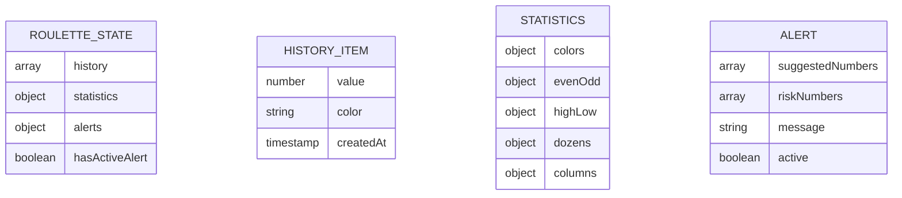

# Documento de Arquitetura Técnica - App de Processamento de Roleta

## 1. Design da Arquitetura

```mermaid
graph TD
    A[Navegador do Usuário] --> B[Aplicação React Frontend]
    B --> C[Estado Local (React Hooks)]
    C --> D[Memória do Navegador]

    subgraph "Camada Frontend"
        B
        C
    end

    subgraph "Camada de Dados (Local)"
        D
    end
```

## 2. Descrição das Tecnologias

* Frontend: React\@18 + Tailwind CSS\@3 + Vite

* Backend: Nenhum

## 3. Definições de Rotas

| Rota | Propósito                                                                        |
| ---- | -------------------------------------------------------------------------------- |
| /    | Dashboard principal, exibe captura de números, histórico, estatísticas e alertas |

## 4. Definições da API

Não aplicável - aplicativo funciona apenas com estado local em memória.

## 5. Modelo de Dados

### 5.1 Definição do Modelo de Dados



### 5.2 Estruturas de Dados TypeScript

```typescript
// Tipos principais do estado da aplicação
interface RouletteNumber {
  value: number; // 0-36
  color: 'green' | 'red' | 'black';
  createdAt: Date;
}

interface Statistics {
  colors: {
    red: number;
    black: number;
    green: number;
  };
  evenOdd: {
    even: number;
    odd: number;
  };
  highLow: {
    high: number; // 19-36
    low: number;  // 1-18
  };
  dozens: {
    first: number;  // 1-12
    second: number; // 13-24
    third: number;  // 25-36
  };
  columns: {
    first: number;  // 1,4,7,10,13,16,19,22,25,28,31,34
    second: number; // 2,5,8,11,14,17,20,23,26,29,32,35
    third: number;  // 3,6,9,12,15,18,21,24,27,30,33,36
  };
}

interface Alert {
  suggestedNumbers: number[];
  riskNumbers: number[];
  message: string;
  active: boolean;
}

interface RouletteState {
  history: RouletteNumber[];
  statistics: Statistics;
  alert: Alert | null;
}

// Configurações da roleta
const ROULETTE_CONFIG = {
  RED_NUMBERS: [1, 3, 5, 7, 9, 12, 14, 16, 18, 19, 21, 23, 25, 27, 30, 32, 34, 36],
  BLACK_NUMBERS: [2, 4, 6, 8, 10, 11, 13, 15, 17, 20, 22, 24, 26, 28, 29, 31, 33, 35],
  GREEN_NUMBERS: [0],
  MAX_HISTORY: 50,
  RACE_INTERVAL: 5
};

// Funções utilitárias
function getNumberColor(num: number): 'green' | 'red' | 'black' {
  if (num === 0) return 'green';
  if (ROULETTE_CONFIG.RED_NUMBERS.includes(num)) return 'red';
  return 'black';
}

function getNeighbors(num: number): number[] {
  // Retorna os 7 vizinhos de cada lado na roda da roleta
  const wheel = [0, 32, 15, 19, 4, 21, 2, 25, 17, 34, 6, 27, 13, 36, 11, 30, 8, 23, 10, 5, 24, 16, 33, 1, 20, 14, 31, 9, 22, 18, 29, 7, 28, 12, 35, 3, 26];
  const index = wheel.indexOf(num);
  const neighbors = [];
  
  for (let i = -7; i <= 7; i++) {
    if (i !== 0) {
      const neighborIndex = (index + i + wheel.length) % wheel.length;
      neighbors.push(wheel[neighborIndex]);
    }
  }
  
  return neighbors;
}
```

## 6. Estrutura de Componentes React

```
src/
├── components/
│   ├── NumberGrid.tsx          // Grid de captura de números 0-36
│   ├── HistoryDisplay.tsx      // Exibição dos últimos 50 números
│   ├── StatisticsCards.tsx     // Cards de estatísticas
│   ├── AlertPanel.tsx          // Painel de alertas e sugestões
│   └── ResetButton.tsx         // Botão de reset
├── hooks/
│   ├── useRouletteState.ts     // Hook principal do estado
│   ├── useStatistics.ts        // Hook para cálculos de estatísticas
│   └── useAlertSystem.ts       // Hook para sistema de alertas
├── utils/
│   ├── rouletteConfig.ts       // Configurações e constantes
│   ├── statisticsCalculator.ts // Funções de cálculo
│   └── alertLogic.ts           // Lógica de detecção de padrões
├── types/
│   └── roulette.ts             // Definições TypeScript
├── App.tsx                     // Componente principal
└── main.tsx                    // Ponto de entrada
```

