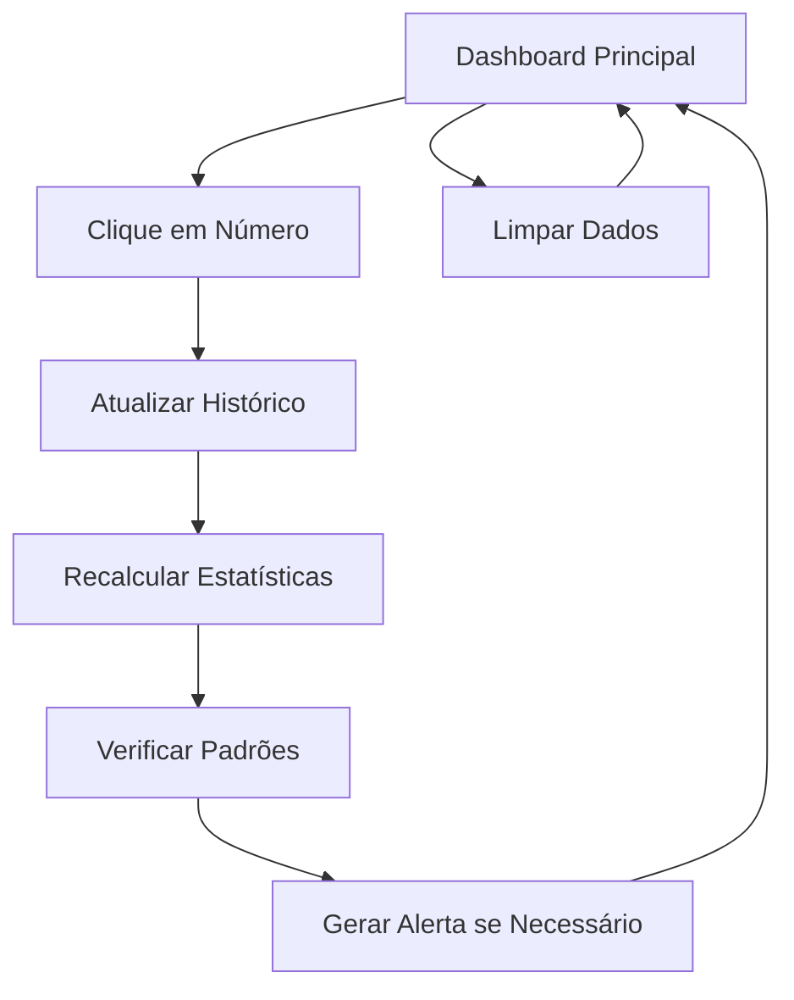

# Documento de Requisitos do Produto - App de Processamento de Roleta

## 1. Visão Geral do Produto
Um aplicativo React para uso pessoal que captura números sorteados em uma roleta padrão europeia (0–36), exibe os últimos 50 resultados e gera estatísticas em tempo real com alertas inteligentes para possíveis entradas de aposta.
- O produto resolve a necessidade de análise manual de padrões em roleta, automatizando o processamento de estatísticas e identificação de oportunidades de aposta.
- Destinado a usuários que desejam uma ferramenta de análise rápida e visual para sessões de roleta ao vivo.

## 2. Funcionalidades Principais

### 2.1 Papéis de Usuário
Não há distinção de papéis - aplicativo de uso pessoal sem autenticação.

### 2.2 Módulo de Funcionalidades
Nosso aplicativo de processamento de roleta consiste nas seguintes páginas principais:
1. **Dashboard Principal**: captura de números, histórico visual, estatísticas em tempo real, área de alertas e controles de reset.

### 2.3 Detalhes das Páginas

| Nome da Página | Nome do Módulo | Descrição da Funcionalidade |
|----------------|----------------|------------------------------|
| Dashboard Principal | Captura de Números | Exibir grid de botões (0-36) com cores oficiais da roleta (verde para 0, vermelho/preto conforme padrão europeu). Capturar cliques e adicionar ao histórico |
| Dashboard Principal | Histórico Visual | Mostrar últimos 50 números sorteados em formato compacto (bolinhas ou quadrados coloridos). Atualizar em tempo real e manter apenas os 50 mais recentes |
| Dashboard Principal | Estatísticas Dinâmicas | Calcular e exibir contagens de: cores (vermelho/preto/verde), pares/ímpares, altos(19-36)/baixos(1-18), dúzias (1ª/2ª/3ª), colunas (1ª/2ª/3ª) |
| Dashboard Principal | Sistema de Alertas | Detectar quando 2 números saem em intervalo de 5 sorteios consecutivos. Gerar sugestão de aposta "7 vizinhos" para 2 números, cobrindo 32 números total. Destacar 5 números de risco |
| Dashboard Principal | Controles | Botão "🔄 Limpar Dados" para resetar histórico e estatísticas |

## 3. Processo Principal
O usuário acessa o dashboard único e interage com o sistema através dos seguintes fluxos:

**Fluxo Principal de Uso:**
1. Usuário clica em números (0-36) conforme saem na roleta real
2. Sistema adiciona número ao histórico e atualiza estatísticas automaticamente
3. Sistema monitora padrões e dispara alertas quando detecta condição de "race"
4. Usuário visualiza sugestões de aposta e números de risco destacados
5. Usuário pode limpar dados a qualquer momento para nova sessão

## 4. Design da Interface do Usuário

### 4.1 Estilo de Design
- **Cores primárias e secundárias:** Verde (#22c55e) para zero, Vermelho (#ef4444) e Preto (#1f2937) para números da roleta, Azul (#3b82f6) e Amarelo (#eab308) para estatísticas
- **Estilo dos botões:** Arredondados com hover effects, tamanho uniforme para números da roleta
- **Fonte e tamanhos:** Inter ou system fonts, tamanhos 14px-18px para texto geral, 12px para estatísticas
- **Estilo de layout:** Grid responsivo, cards compactos, dashboard single-page
- **Ícones e emojis:** Usar emojis simples (🔄 para reset) e ícones minimalistas

### 4.2 Visão Geral do Design das Páginas

| Nome da Página | Nome do Módulo | Elementos da UI |
|----------------|----------------|------------------|
| Dashboard Principal | Captura de Números | Grid 6x6 com botão especial para 0. Cores: verde (#22c55e) para 0, vermelho (#ef4444) e preto (#1f2937) conforme padrão oficial. Hover effects e feedback visual |
| Dashboard Principal | Histórico Visual | Linha horizontal scrollável com círculos coloridos (20px diâmetro). Cores correspondentes aos números. Máximo 50 itens visíveis |
| Dashboard Principal | Estatísticas | Cards compactos em grid 2x3. Fundo branco, bordas sutis, texto azul/amarelo. Contadores grandes e labels descritivos |
| Dashboard Principal | Alertas | Card destacado com fundo laranja/vermelho (#f97316). Lista dos 2 números sugeridos e visualização dos 5 números de risco com bordas marrons |
| Dashboard Principal | Controles | Botão centralizado no rodapé, fundo vermelho, texto branco, ícone 🔄 |

### 4.3 Responsividade
Desktop-first com adaptação para tablets. Layout em 3 colunas no desktop (captura à esquerda, histórico/estatísticas no centro, alertas à direita) que se reorganiza em stack vertical em t